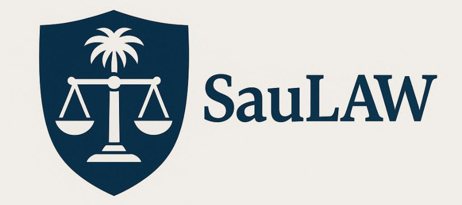
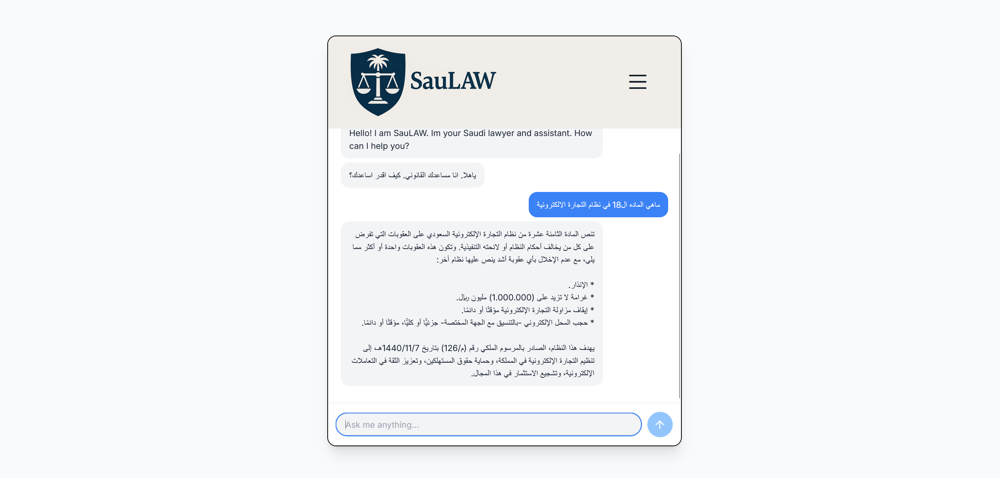

---

## 📖 About  
**SauLAW** is an AI-powered legal assistant specialized in **Saudi Arabian laws and regulations**.  
It helps users get legal insights, guidance, and document understanding quickly and efficiently, trained on official sources like [BOE.gov.sa](https://www.boe.gov.sa).

---

## 🖼️ Showcase  
Here’s a glimpse of SauLAW in action:  

---

## ✨ Features  
- ⚖️ Expert knowledge in Saudi laws  
- 📝 Answers based on uploaded documents  
- 🌐 Bilingual support (Arabic & English)  
- 🔍 Fast, AI-driven search and insights  

---

## 🤝 Acknowledgments

Special thanks to **NUS Camp**, our amazing **team members**, and our mentor **Dr. Ganesh Neelakanta Iyer** for guidance.
Proudly won **3rd place** with *SauLAW* project 🏆.

## ⚠️ Disclaimer  
SauLAW is an experimental project created for research and educational purposes only.  
It is **not a licensed lawyer** and should not be relied on for professional legal advice.  

For any real legal matters, please consult a qualified lawyer or the official Saudi legal authorities.  

---
